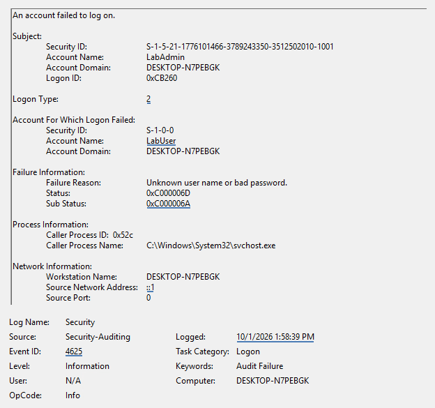
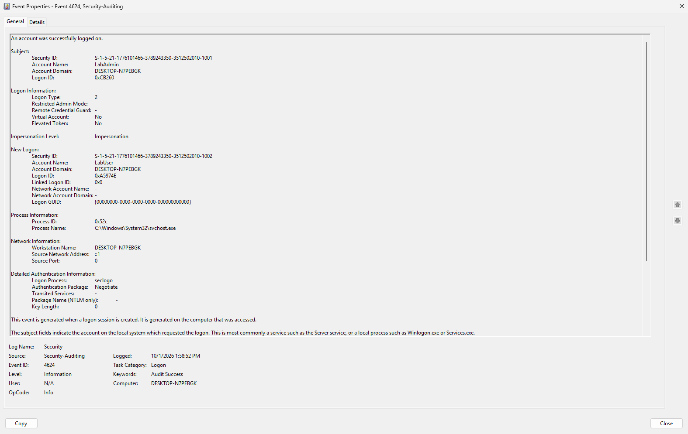
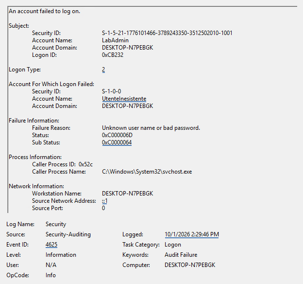

# Windows Authentication Lab

A hands-on lab analysing successful and failed authentication attempts through Windows Security logs.

## Environment

Windows 11 Enterprise Evaluation · Hyper-V · Event Viewer  
Local accounts: `LabAdmin` and `LabUser`

## Investigation

I generated controlled authentication attempts using `runas`, then inspected the corresponding events in Event Viewer.

| Time | Event ID | Account | Result |
|---|---|---|---|
| 13:58:39 | 4625 | LabUser | Incorrect password |
| 13:58:52 | 4624 | LabUser | Successful authentication |
| 14:29:46 | 4625 | UtenteInesistente | Unknown username |

*1 October 2026 — local time, UTC+02:00.*

## Findings

- `Subject` identifies the requesting account; the target account identifies who attempted to authenticate.
- SubStatus `0xC000006A` indicates an incorrect password; `0xC0000064` indicates an unknown username.
- Logon Type `2` and loopback address `::1` are consistent with the local tests.
- LabUser’s failed attempt was followed by a successful authentication approximately 13 seconds later.

These were controlled lab tests. A failure followed by a success does not, by itself, establish a compromise.

## Report

[Read the full analysis](Analisi-autenticazioni-Windows-Abdellah-Bayar.pdf)

### Projects

[Windows Authentication Lab](https://github.com/abdellahbayar/windows-authentication-lab)

## Evidence

### Incorrect password
Event 4625 — LabUser — SubStatus `0xC000006A`.

### Successful authentication
Event 4624 — LabUser — 13 seconds after the failed attempt.

### Unknown username
Event 4625 — UtenteInesistente — SubStatus `0xC0000064`.

